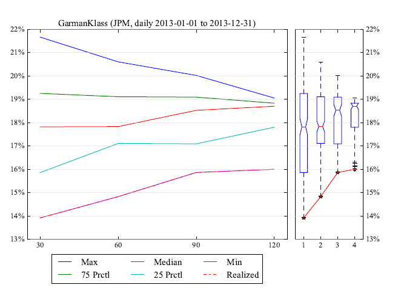
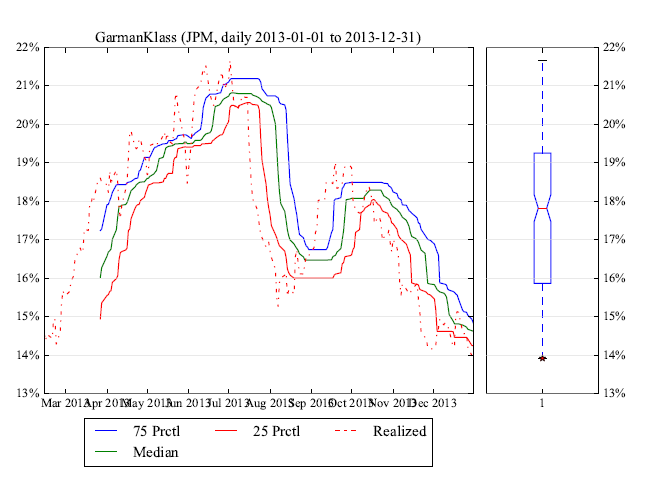
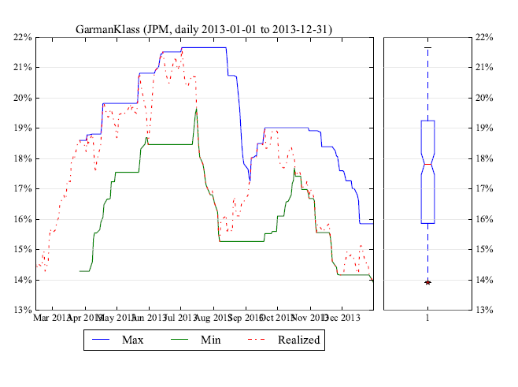
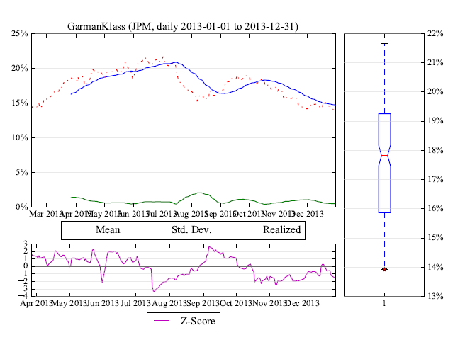
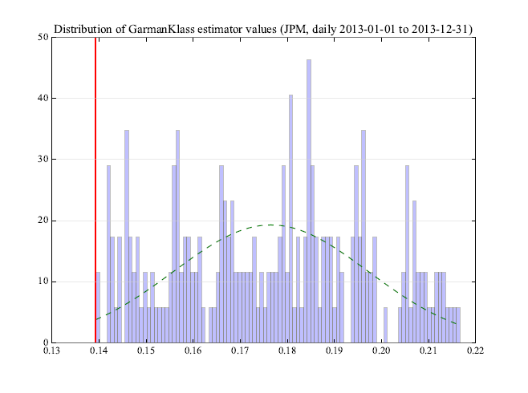
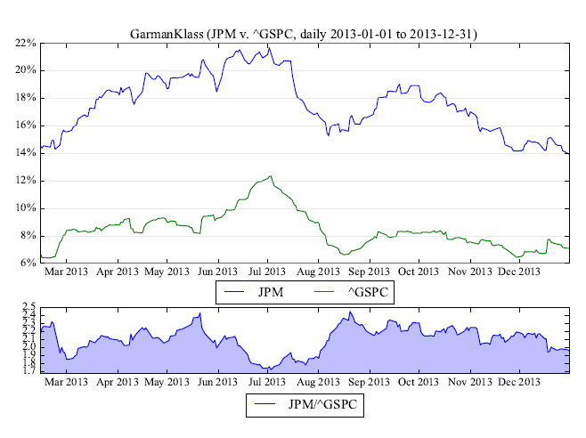
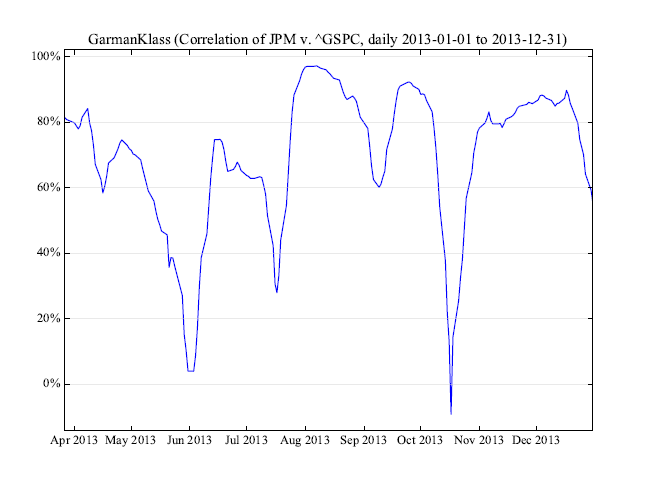
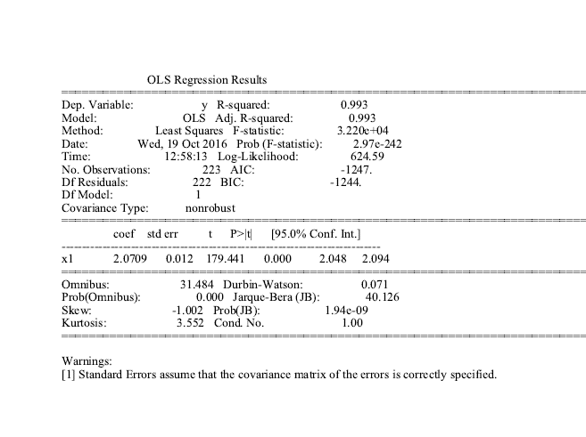

# volest #

## A complete set of volatility estimators based on Euan Sinclair's Volatility Trading. ##
### http://www.amazon.com/gp/product/0470181990/tag=quantfinancea-20 ###

### Volatility estimators include: ###

* Garman Klass
* Hodges Tompkins
* Parkinson
* Rogers Satchell
* Yang Zhang
* Standard Deviation

Also includes

* Skew
* Kurtosis
* Correlation

For each of the estimators, plot:

* Probability cones
* Rolling quantiles
* Rolling extremes
* Rolling descriptive statistics
* Histogram
* Comparison against arbirary comparable
* Correlation against arbirary comparable
* Regression against arbirary comparable

Also creates a term sheet with all the metrics printed to a PDF.

### Page 1 - Volatility cones ###


### Page 2 - Volatility rolling percentiles ###


### Page 3 - Volatility rolling min and max ###


### Page 4 - Volatility rolling mean, standard deviation and zscore ###


### Page 5 - Volatility distribution ###


### Page 6 - Volatility, benchmark volatility and ratio###


### Page 7 - Volatility rolling correlation with benchmark ###


### Page 3 - Volatility OLS results ###


Example usage:

```python

import volest

# variables to initialize class
symbol = 'JPM'
start = '2013-01-01'
end = '2013-12-31'
estimator = 'GarmanKlass'


#variables for the instances
window=30
windows=[30, 60, 90, 120]
quantiles=[0.25, 0.75]
bins=100
normed=True
bench='^GSPC'


# initialize class
vol = volest.VolatilityEstimator(symbol, start, end, estimator)


# call plt.show() on any of the below
fig, plt = vol.cones(windows=windows, quantiles=quantiles)
fig, plt = vol.rolling_quantiles(window=window, quantiles=quantiles)
fig, plt = vol.rolling_extremes(window=window)
fig, plt = vol.rolling_descriptives(window=window)
fig, plt = vol.histogram(window=window, bins=bins, normed=normed)
fig, plt = vol.benchmark_compare(window=window, bench=bench)
fig, plt = vol.benchmark_correlation(window=window, bench=bench)


# prints regression statistics
print vol.benchmark_regression(window=window, bench=bench)


# creates a pdf term sheet with all metrics
vol.term_sheet(window, windows, quantiles, bins, normed, bench)

```

Hit me on twitter with comments, questions, issues @jasonstrimpel
